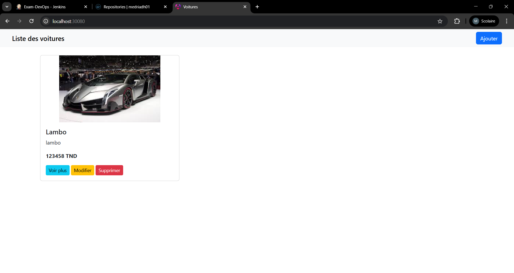
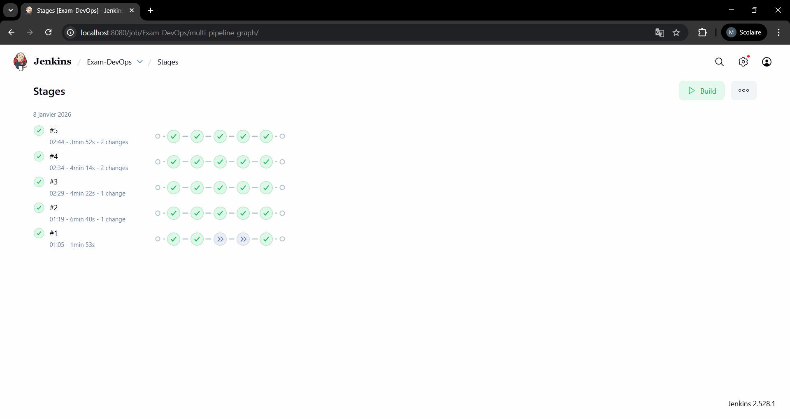
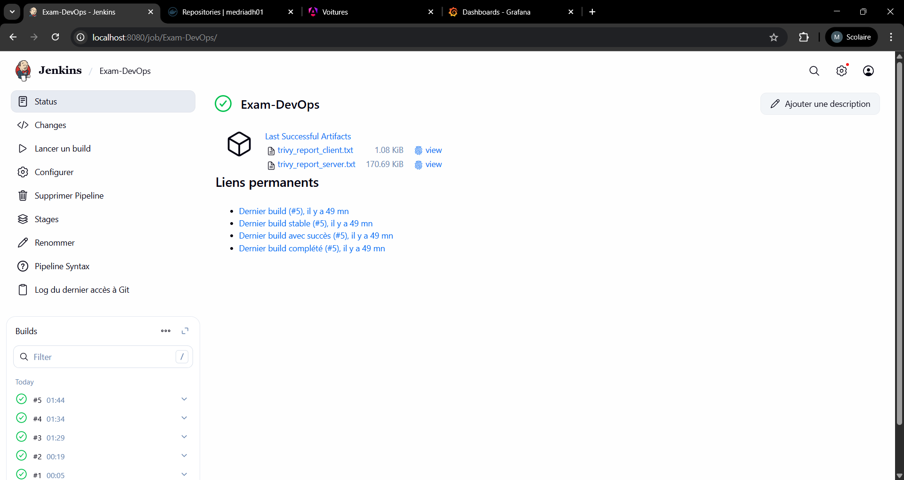
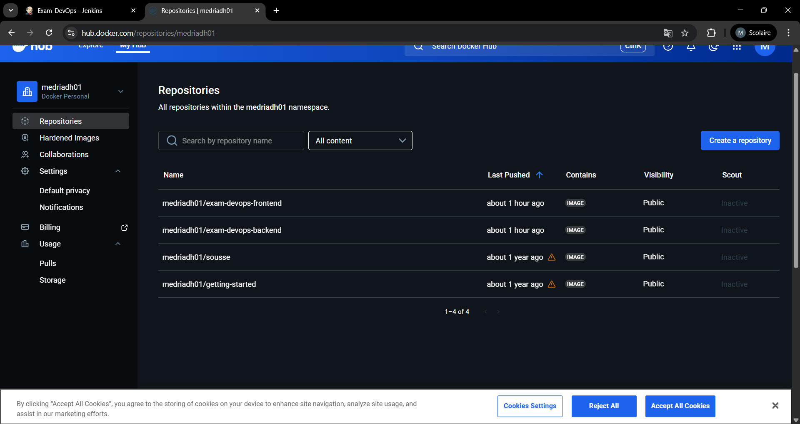
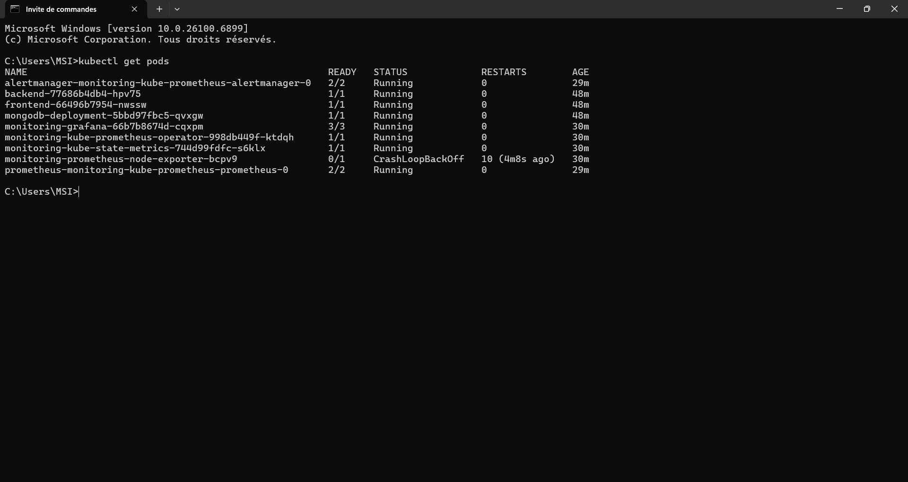
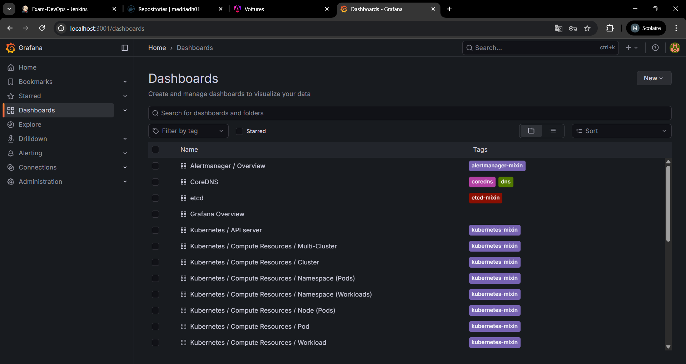

# Mini-Projet DevOps – Gestion de Voitures

**Auteur :** Mohamed Riadh Essridi  
**Encadrant :** Dr. Salah Gontara  
**Année :** 2025–2026

---

## 1. Introduction

Ce projet consiste en la mise en place d'une **chaîne DevOps complète** pour une application **Fullstack de gestion de voitures**.  
L'objectif est de démontrer la maîtrise des concepts suivants :

- Conteneurisation avec Docker
- Intégration Continue (CI)
- Orchestration avec Kubernetes & Helm
- Sécurité des images Docker
- Observabilité et monitoring

### Stack Technique

- **Frontend :** Angular 17+ (servi par Nginx)
- **Backend :** Node.js / Express
- **Base de données :** MongoDB
- **CI/CD :** Jenkins, Docker Hub, Trivy
- **Orchestration :** Kubernetes (Docker Desktop), Helm
- **Monitoring :** Prometheus, Grafana

---

## 2. Structure du Projet

```text
.
├── backend/                # Code source API Express + Dockerfile
├── frontend/               # Code source Angular + Dockerfile
├── kubernetes/
│   └── voitures-app/       # Helm Chart (templates & values)
├── docker-compose.yml      # Orchestration locale pour tests
├── Jenkinsfile             # Pipeline CI/CD automatisé
└── README.md               # Documentation du projet
```

---

## 3. Intégration Continue (CI) avec Jenkins

Le fichier Jenkinsfile à la racine du projet automatise les étapes suivantes à chaque modification du code :

### Checkout
Récupération du code source depuis GitHub.

### Build
Construction des images Docker pour :
- Frontend
- Backend

### Security Scan (Trivy)
Analyse des vulnérabilités des images Docker (exigence obligatoire – point 3.3).

### Push
Publication des images sur Docker Hub avec un tag correspondant au numéro de build Jenkins.

📌 **Note :**
Les rapports Trivy sont archivés comme artefacts Jenkins afin de permettre leur consultation ultérieure.

---

## 4. Orchestration avec Kubernetes & Helm

Le déploiement de l'application est géré via Helm sur un cluster Kubernetes local (Docker Desktop).

### Installation du Chart Helm

```bash
cd kubernetes
helm install ma-voiture ./voitures-app
```

### Accès aux services

#### Frontend
Accessible via NodePort :  
👉 http://localhost:30080



#### Backend
Accessible via port-forward :

```bash
kubectl port-forward svc/backend-service 3000:3000
```

---

## 5. Monitoring & Observabilité

Le monitoring est assuré grâce à la stack kube-prometheus-stack.

### Installation

```bash
helm repo add prometheus-community https://prometheus-community.github.io/helm-charts
helm install monitoring prometheus-community/kube-prometheus-stack
```

### Accès à Grafana

```bash
kubectl port-forward svc/monitoring-grafana 3001:80
```

- **URL :** http://localhost:3001
- **Login :** admin
- **Password :** [INSÉRER LE MOT DE PASSE DÉCODÉ]

---

## 6. Preuves de Fonctionnement (Captures d'Écran)

### A. Pipeline Jenkins


**Description :**  
Pipeline Jenkins entièrement en vert montrant le succès des étapes Build, Scan et Push.

### B. Sécurité avec Trivy


**Description :**  
Extrait des logs Jenkins montrant l'analyse de vulnérabilités des images Docker.

### C. Docker Hub


**Description :**  
Dépôts Docker Hub :
- exam-devops-backend
- exam-devops-frontend

mis à jour avec les derniers tags.

### D. État du Cluster Kubernetes


**Description :**  
Tous les pods sont en état Running, indiquant un déploiement réussi.

### E. Monitoring Grafana


**Description :**  
Dashboard Kubernetes affichant :
- Consommation CPU
- Utilisation mémoire (RAM) des pods de l'application.

---

## 7. Conclusion

Ce mini-projet répond entièrement aux objectifs définis dans le cahier des charges.

L'utilisation de Helm a permis une gestion flexible et modulaire des manifestes Kubernetes.

L'intégration de Trivy renforce la sécurité des images Docker avant leur déploiement.

Le monitoring avec Prometheus & Grafana assure une visibilité complète sur l'état et les performances de l'application.
